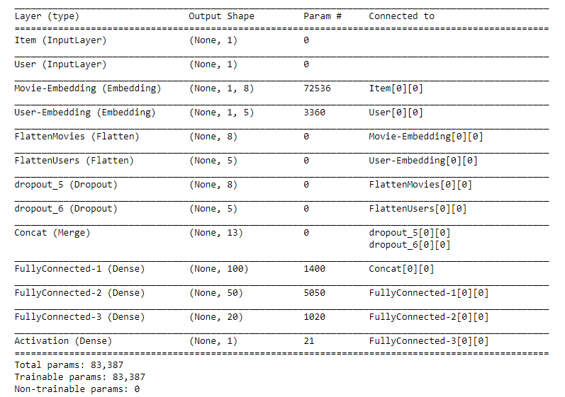
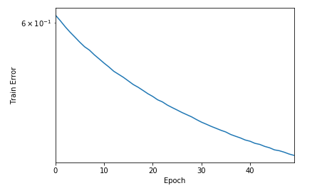
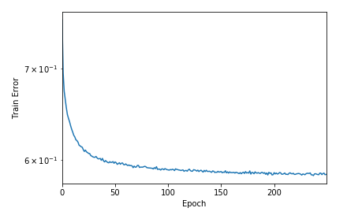

# Neural-networks-based-Recommender-system
In this notebook, we will built a recommender system using Matrix factorization later implement the same in keras.

# Dataset
MovieLens : http://grouplens.org/datasets/movielens/20m/
# Goal
* The goal of this work is to learn from the basics *how matrix factorization works*
* The jupyter notebook has all the explantions.
* Further, construct a *neural network* in keras to solve for the same problem (matrix factorization)
* Use neural network with *embeddings layer* instead of *one-hot encoding*
* **Why to use embeddings ?**
  * One-hot encoded vectors are high-dimensional and sparse. Lets take the example of movie lens dataset. We have around 700 users and 9000 items. Thus, when using one hot encoding or pivot matrix as shown above, we have a matrix of size ~700   * 9000.This means that, when using pivot, each user item pair will be represented by a vector containing 9000 integers. And suppose the user has rated only one 10 items, then 8990 of these integers are zeros. In a big dataset this approach is not computationally efficient.
  * The vectors of each embedding get updated while training the neural network. This allows us to visualize relationships between users and items, but also between everything that can be turned into a vector through an embedding layer. Thus we can generate embeddings for indexes of users' or items' features such as occupation, age, genre etc. even after including more features the vector will still be low-dimensional.
  
  
  
# Final model used:

# Results : MSE

* Matrix factorization using neural networks :

  
* Neural networks for recommendation using *embeddings* :

# Further task
* Include other features from users and movies
* Update layers to genreralize for the new latent features added
* Train, plot and compare RMSE
